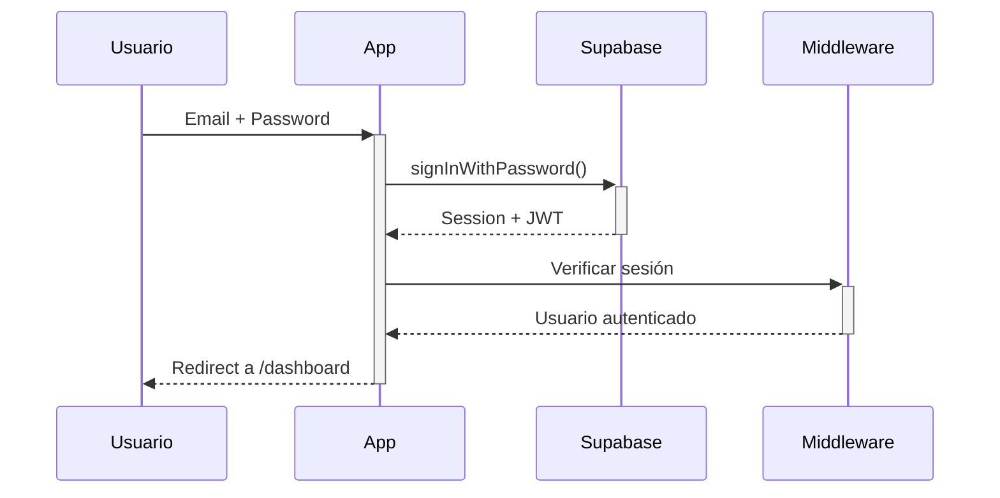

# 🔐 Autenticación y Autorización

> Guía de implementación de auth en JUNTAY.

---

## Stack de Autenticación

| Componente | Tecnología |
|------------|------------|
| Provider | Supabase Auth |
| Session | JWT + Cookies |
| Roles | RLS (Row Level Security) |
| 2FA | Pendiente Q1-2026 |

---

## Flujo de Login



---

## Roles del Sistema

| Rol | Descripción | Permisos |
|-----|-------------|----------|
| `admin` | Administrador total | Todo |
| `gerente` | Supervisor de sucursal | Ver reportes, gestionar cajas |
| `cajero` | Operador de caja | Solo su caja asignada |
| `cobrador` | Agente de campo | Solo sus rutas asignadas |

---

## Implementación en Server Actions

```typescript
'use server'
import { createClient } from '@/lib/supabase/server'

export async function protectedAction() {
    const supabase = await createClient()
    const { data: { user } } = await supabase.auth.getUser()
    
    if (!user) {
        return { error: 'No autenticado' }
    }
    
    // Lógica protegida...
}
```

---

## RLS Policies

Todas las tablas deben tener RLS habilitado:

```sql
-- Ejemplo: usuarios solo ven su empresa
ALTER TABLE creditos ENABLE ROW LEVEL SECURITY;

CREATE POLICY "Users see own tenant" ON creditos
    FOR ALL USING (tenant_id = auth.jwt()->>'tenant_id');
```

---

## Middleware de Protección

`src/middleware.ts`:
```typescript
export async function middleware(request: NextRequest) {
    const supabase = createServerClient(...)
    const { data: { session } } = await supabase.auth.getSession()
    
    if (!session && request.nextUrl.pathname.startsWith('/dashboard')) {
        return NextResponse.redirect(new URL('/login', request.url))
    }
}
```

---

## Reglas de Seguridad (AGENT.md)

1. **NUNCA** exponer tokens en código
2. **SIEMPRE** validar sesión en server actions
3. **NUNCA** confiar en datos del cliente
4. **SIEMPRE** usar RLS para filtrar datos

---

## TODO Q1-2026

- [ ] Implementar 2FA para admins
- [ ] Audit log de accesos
- [ ] Session management UI
- [ ] Password policies

---

*Última actualización: Diciembre 2025*
