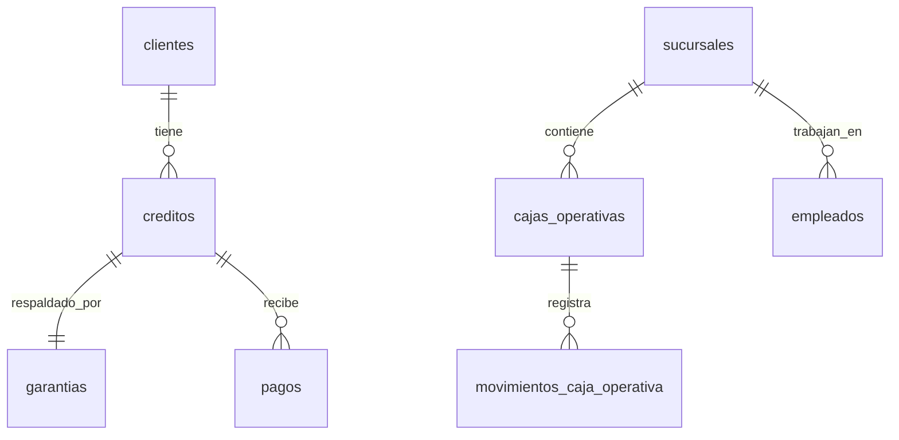

# 🗄️ Base de Datos

> Modelo de datos y guía de migraciones de JUNTAY.

---

## Stack de Base de Datos

| Componente | Tecnología |
|------------|------------|
| Cloud DB | Supabase (PostgreSQL 15) |
| Local DB | RxDB (IndexedDB) |
| ORM | Supabase-js (directo) |
| Migraciones | SQL en `supabase/migrations/` |

---

## Tablas Principales

### Core Financiero
| Tabla | Propósito |
|-------|-----------|
| `cuentas_financieras` | Bóvedas y cuentas bancarias |
| `cajas_operativas` | Sesiones de caja por cajero |
| `movimientos_caja_operativa` | Ledger inmutable |
| `transacciones_capital` | Aportes, retiros, fondeo |

### Negocio
| Tabla | Propósito |
|-------|-----------|
| `clientes` | Datos KYC de clientes |
| `creditos` | Contratos de préstamo |
| `pagos` | Registro de cobros |
| `garantias` | Bienes en custodia |

### Q3-2025 (Nuevas)
| Tabla | Propósito |
|-------|-----------|
| `sucursales` | Multi-sucursal |
| `transacciones_bancarias` | Conciliación bancaria |
| `ventas_remates` | Módulo de remates |
| `visitas` | App cobrador |
| `fotos_garantia` | Galería de fotos |

---

## Diagrama ER Simplificado



---

## Migraciones

### Ubicación
```
supabase/migrations/
├── 20251201000001_initial.sql
├── 20251215000001_fix_schema.sql
├── 20251219000001_sucursales.sql
├── 20251219000002_integracion_bancaria.sql
├── 20251219000003_remates.sql
├── 20251219000004_app_cobrador.sql
└── 20251219000005_fotos_garantia.sql
```

### Convención de Nombres
```
YYYYMMDD_HHMMSS_descripcion.sql
```

### Crear Nueva Migración
```bash
# Crear archivo
touch supabase/migrations/$(date +%Y%m%d%H%M%S)_nombre.sql

# Aplicar localmente
npx supabase migration up

# O manualmente
docker exec -i supabase_db_juntay_api psql -U postgres -d postgres < migrations/file.sql
```

---

## RLS (Row Level Security)

**Todas las tablas deben tener RLS habilitado.**

### Patrón Básico
```sql
ALTER TABLE tabla ENABLE ROW LEVEL SECURITY;

-- Política por tenant (Q1-2026)
CREATE POLICY "tenant_isolation" ON tabla
    FOR ALL USING (tenant_id = auth.jwt()->>'tenant_id');
```

### Estado Actual
| Tabla | RLS |
|-------|-----|
| Tablas core | ✅ |
| Tablas Q3 | ⚠️ Pendiente Q1-2026 |

---

## Triggers Importantes

| Trigger | Tabla | Propósito |
|---------|-------|-----------|
| `trg_ledger_smart_lock` | movimientos | Inmutabilidad del ledger |
| `trg_auto_liquidar_caja` | cajas | Auto-cierre de caja |
| `trg_actualizar_saldo` | cuentas_financieras | Saldo en tiempo real |

---

## Campos de Auditoría

Todas las tablas tienen:
```sql
created_at TIMESTAMPTZ DEFAULT NOW()
updated_at TIMESTAMPTZ DEFAULT NOW()
_deleted BOOLEAN DEFAULT FALSE  -- Para RxDB sync
```

---

## Tipos de Datos Financieros

**IMPORTANTE:** Todos los montos se almacenan como `DECIMAL(12,2)` y se calculan con Decimal.js.

```typescript
// En código
import { dinero, sumar } from '@/lib/utils/decimal'
const total = sumar("1500.00", "300.50")
```

---

## Comandos Útiles

```bash
# Ver estado de migraciones
npx supabase migration list

# Reset completo (¡cuidado!)
npx supabase db reset

# Dump de datos
pg_dump -h localhost -U postgres -d postgres > backup.sql
```

---

## Relacionado

- [02_architecture.md](./02_architecture.md) - Arquitectura
- [SYSTEM_BLUEPRINT.md](./SYSTEM_BLUEPRINT.md) - Blueprint completo

---

*Última actualización: Diciembre 2025*
