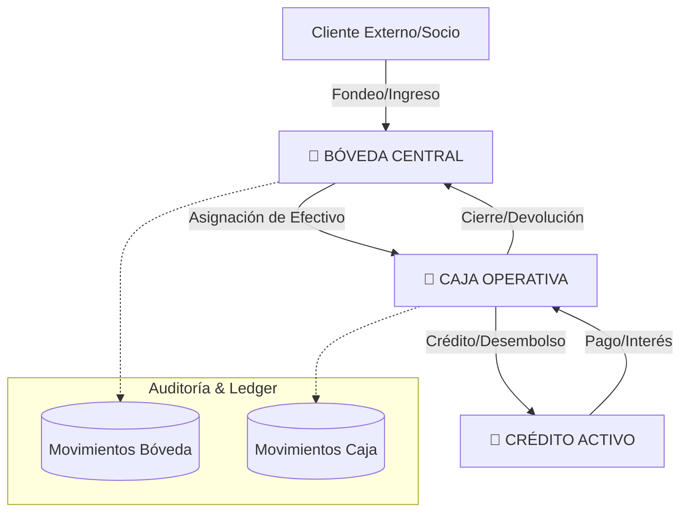

# 📘 JUNTAY — DOCUMENTO TÉCNICO OFICIAL v3.1 (Master Guide)

**Versión del Documento:** 3.1  
**Basado en Build:** v3.3.0 ("Intelligent Catalog")  
**Fecha de Emisión:** 26 de Noviembre, 2025  
**Arquitecto Líder:** Mikis  
**Tecnología:** Next.js 14, Supabase, TypeScript, Tailwind (Local-First)

---

## 1️⃣ Resumen Ejecutivo / Visión del Sistema

### 1.1 ¿Qué es JUNTAY?

JUNTAY es un sistema de gestión financiera de nivel bancario ("Core Bancario") diseñado específicamente para casas de empeño modernas. A diferencia de las soluciones tradicionales basadas en hojas de cálculo o software de escritorio legado, JUNTAY opera bajo una arquitectura web **Local-First**, garantizando la integridad de los datos, la inmutabilidad financiera y una experiencia de usuario (UX) de "Clase Mundial".

### 1.2 Objetivo Principal

Reemplazar la operativa manual y fragmentada (Excel + WhatsApp) por un sistema centralizado que automatice el ciclo de vida del crédito prendario, garantice "Cero Pérdida Financiera" mediante libros mayores inmutables y ofrezca herramientas de tasación inteligente.

### 1.3 Problemas Críticos que Resuelve

- **Integridad Financiera:** Elimina los cuadres de caja manuales y las pérdidas por "errores de cálculo".
- **Seguridad:** Implementa roles estrictos y RLS (Row Level Security) donde cada centavo tiene un dueño y una trazabilidad.
- **Estandarización de Tasaciones:** Sustituye el "ojo" del tasador por una matriz de valoración estandarizada (30%-85% LTV).
- **Eficiencia Operativa:** Reduce el tiempo de atención mediante autocompletado de datos (Smart Paste AI) y flujos guiados.

---

## 2️⃣ Arquitectura General del Sistema

### 2.1 Enfoque: Local-First & Inmutabilidad

> El dinero nunca se crea ni se destruye en el Frontend; solo se transfiere entre entidades (Bóveda ↔ Caja ↔ Cliente) mediante transacciones atómicas en el Backend.

### 2.2 Principio Rector: "Performance First"

> **"Siempre haremos lo mejor para la mayor velocidad del sistema."**

Toda decisión técnica priorizará la velocidad de respuesta percibida por el usuario.

- **Datos Estáticos (UBIGEO, Catálogos):** Se empaquetan en el código (TypeScript) para carga instantánea y cero latencia. No se usan tablas SQL para datos que no cambian.
- **Optimistic UI:** La interfaz se actualiza inmediatamente mientras la operación se procesa en segundo plano.
- **Local-First:** Se prefiere el cómputo y validación en el cliente/servidor local antes que llamadas costosas a APIs externas.

### 2.3 Stack Tecnológico (Estricto)

- **Frontend:** Next.js 14 (App Router) + React 19.
- **Lenguaje:** TypeScript 5 (Strict Mode obligatoria).
- **UI Framework:** Tailwind CSS v4 + shadcn/ui (Glassmorphism & Mesh Gradients).
- **Backend / Database:** Supabase (PostgreSQL 15) corriendo en Docker (Local) y Cloud (Prod).
- **Infraestructura:** WSL 2 (Ubuntu 24.04) para paridad dev/prod.
- **Estado:** Server Actions para mutaciones + React Hooks para UI.
- **Integraciones:**
  - **WhatsApp Business:** WAHA (Oracle Cloud) para verificación 2FA y notificaciones.
  - **APIs Gubernamentales:** RENIEC/SUNAT.

### 2.3 Diagrama de Flujo de Datos (Arquitectura de Bóveda)



---

## 3️⃣ Modelo de Datos (Core Bancario)

El modelo de datos se centra en la integridad referencial y la auditoría. No se permite el borrado físico (Soft Delete) en tablas financieras.

### 3.1 Entidades Financieras (Ledger)

| Entidad | Descripción | Reglas Clave |
| :--- | :--- | :--- |
| `boveda_central` | Singleton. Custodia el capital total de la empresa (Físico + Bancos). | Solo 1 registro. Campos: `saldo_total`, `saldo_disponible`. |
| `cajas_operativas` | Sesión temporal de un cajero. Representa la ventanilla. | Estados: `abierta`, `cerrada`. Vinculada a `usuario_id`. |
| `movimientos_caja_operativa` | **LIBRO MAYOR**. Registro atómico de cada transacción en ventanilla. | **INSERT ONLY**. Tipos: `prestamo`, `pago`, `apertura`, `cierre`. |
| `movimientos_boveda_auditoria` | Registro de fondeo y movimientos de alto nivel. | Campo `metadata` (JSONB) obligatorio para trazabilidad externa (Yape/Bancos). |

### 3.2 Entidades de Negocio (El Activo)

| Entidad | Descripción | Relaciones |
| :--- | :--- | :--- |
| `clientes` | Información KYC, Score crediticio y documentos. | 1:N con Créditos, Garantías. |
| `garantias` | Bienes físicos en custodia. Incluye fotos y tasación. | 1:1 con Créditos (usualmente). Estados: `en_prenda`, `liberado`, `remate`. |
| `creditos` | Contrato financiero. Define tasas, plazos y saldos. | N:1 con Clientes. Campos: `monto`, `tasa`, `frecuencia`, `saldo_pendiente`. |
| `tasaciones` | Valoración del bien antes del crédito. | Matriz de % de préstamo basada en condición. |
| `verificacion_whatsapp` | Códigos 2FA para validación de teléfonos. | Expiración 5 min. Vinculado a teléfono. |

### 3.3 Motor de Reglas (`system_settings`)

Tabla singleton que evita el hardcoding.

- `yape_limite_diario`: Monto máximo permitido.
- `exigir_evidencia_yape`: Boolean.
- `tasas_interes_config`: JSON con las tasas vigentes por frecuencia.

---

## 4️⃣ Módulos del Sistema (Funcionales)

### 4.1 Módulo de Tesorería (Jerarquía Nivel 0)

- **Objetivo:** Gestión del capital macro.
- **Funciones:** Inyección de capital (Socios), Asignación a Cajeros, Auditoría de Fondeo.
- **Validaciones:** No se puede asignar más dinero del `saldo_disponible` en Bóveda.

### 4.2 Módulo de Caja (Jerarquía Nivel 1)

- **Objetivo:** Operativa diaria de ventanilla.
- **Flujo:**
    1. **Apertura:** Gerente asigna monto inicial.
    2. **Operación:** Registro de Préstamos (Salida) y Pagos (Entrada).
    3. **Cierre Ciego:** El cajero cuenta el físico, el sistema compara con el lógico. Se genera reporte de sobras/faltas.
- **UI:** Terminal financiera con desglose de billetes y monedas.

### 4.3 Módulo de Créditos & Tasaciones (Core)

- **Tasación Inteligente:**
  - Matriz: Excelente (85%), Muy Bueno (75%), Bueno (65%), Regular (50%), Malo (30%).
  - Cálculo automático del `monto_prestamo_autorizado`.
- **Originación:**
  - Selección de frecuencia (Diario, Semanal, Quincenal, Mensual).
  - Cálculo de interés en tiempo real (Interés simple para MVP).
  - Validación contra `saldo_caja` disponible.

### 4.4 Módulo de Clientes ("Intelligent Catalog")

- **Características:** Búsqueda Server-Side, Scoring de riesgo, Historial de pagos.
- **Smart Paste AI:** Capacidad de pegar texto desordenado (ej. de WhatsApp) y que el sistema extraiga Nombre y DNI automáticamente.
- **Verificación WhatsApp:** Validación de número telefónico real mediante código OTP.

---

## 5️⃣ Protocolos de Desarrollo

### Protocolo A: Nueva Operación Financiera

1. **Interfaz:** Definir tipos en `src/lib/types/`.
2. **Server Action:**
   - Validar Auth y Permisos.
   - Leer `system_settings` (Reglas dinámicas).
   - Ejecutar transacción en BD (Atómica).
3. **UI:** Shadcn/ui + Toast notifications.

### Protocolo B: Seguridad RLS

- **Cajeros:** Solo ven/editan su propia caja activa (`auth.uid() = usuario_id`).
- **Admins:** Acceso total.
- **Configuración:** Solo Admins pueden hacer UPDATE en `system_settings`.

### Protocolo C: Integración WhatsApp

- **Envío:** `enviarCodigoWhatsapp(telefono)` (Límite 100/hora).
- **Validación:** `verificarCodigoWhatsapp(telefono, codigo)`.
- **UX:** Soporte de tecla Enter en inputs, Toast notifications para feedback.

---

## 6️⃣ Flujos de Trabajo Detallados

### 6.1 Remate de Prenda (Ciclo de Vida)

```mermaid
sequenceDiagram
    participant Cron as Sistema (Cron)
    participant DB as Base de Datos
    participant Admin
    
    Cron->>DB: Buscar créditos vencidos > X días
    DB-->>Cron: Lista de créditos
    Cron->>DB: Actualizar estado Garantía -> 'en_remate'
    Cron->>DB: Notificar a Admin (Dashboard)
    Admin->>DB: Registrar Venta de Remate
    DB->>DB: Ingreso a Caja (Tipo: 'venta_remate')
    DB->>DB: Cerrar Crédito (Castigo/Recupero)
```



### 6.2 Renovación con Pago de Interés

1. Cliente solicita renovar.
2. Cajero selecciona "Renovar" en Dashboard.
3. Sistema calcula interés acumulado a la fecha.
4. Cliente paga **solo el interés**.
5. Sistema:
   - Registra ingreso `pago_interes` en Caja.
   - Actualiza `fecha_vencimiento` del crédito.
   - Mantiene el capital original.
   - Genera nuevo cronograma (opcional).

---

## 7️⃣ Reglas de Negocio (Núcleo Operativo)

**RN-01: Tasas de Interés (Configurable)**

| Frecuencia | Tasa Sugerida | Perfil de Cliente |
| :--- | :--- | :--- |
| Diario | 25% | Comercios de alta rotación. |
| Semanal | 22% | Trabajadores independientes. |
| Quincenal | 20% (Estándar) | Empleados, pago de planilla. |
| Mensual | 18% | Garantías de alto valor / Largo plazo. |

**RN-02: Jerarquía de Seguridad**

- **Bóveda:** Solo accesible por ROL admin.
- **Caja:** Cajero solo ve su caja activa.
- **Edición:** Los movimientos financieros son inmutables. Solo se corrigen con contra-asientos.

**RN-03: Validación de Crédito**

- El monto del préstamo NUNCA puede exceder el `monto_prestamo_autorizado`.
- El cliente debe tener documentos completos (DNI verificado) para créditos > S/ 1,000.

---

## 8️⃣ Diseño de Base de Datos (SQL Resumen)

```sql
-- TABLA: BÓVEDA CENTRAL (Singleton)
CREATE TABLE public.boveda_central (
    id UUID PRIMARY KEY DEFAULT gen_random_uuid(),
    saldo_total DECIMAL(12,2) NOT NULL DEFAULT 0,
    saldo_disponible DECIMAL(12,2) NOT NULL DEFAULT 0,
    saldo_asignado DECIMAL(12,2) NOT NULL DEFAULT 0,
    updated_at TIMESTAMP WITH TIME ZONE DEFAULT timezone('utc'::text, now())
);

-- TABLA: CAJAS OPERATIVAS
CREATE TABLE public.cajas_operativas (
    id UUID PRIMARY KEY DEFAULT gen_random_uuid(),
    usuario_id UUID REFERENCES auth.users(id),
    numero_caja SERIAL,
    estado VARCHAR(20) CHECK (estado IN ('abierta', 'cerrada', 'arqueo')),
    saldo_inicial DECIMAL(12,2) NOT NULL,
    saldo_actual DECIMAL(12,2) NOT NULL,
    fecha_apertura TIMESTAMP DEFAULT now(),
    fecha_cierre TIMESTAMP
);

-- TABLA: MOVIMIENTOS (Ledger)
CREATE TABLE public.movimientos_caja_operativa (
    id UUID PRIMARY KEY DEFAULT gen_random_uuid(),
    caja_id UUID REFERENCES public.cajas_operativas(id),
    tipo VARCHAR(30) NOT NULL, -- 'prestamo', 'pago', 'apertura'...
    monto DECIMAL(12,2) NOT NULL,
    saldo_anterior DECIMAL(12,2) NOT NULL,
    saldo_nuevo DECIMAL(12,2) NOT NULL,
    metadata JSONB DEFAULT '{}'::jsonb, -- Para trazabilidad Yape/Fotos
    created_at TIMESTAMP DEFAULT now()
);
```
