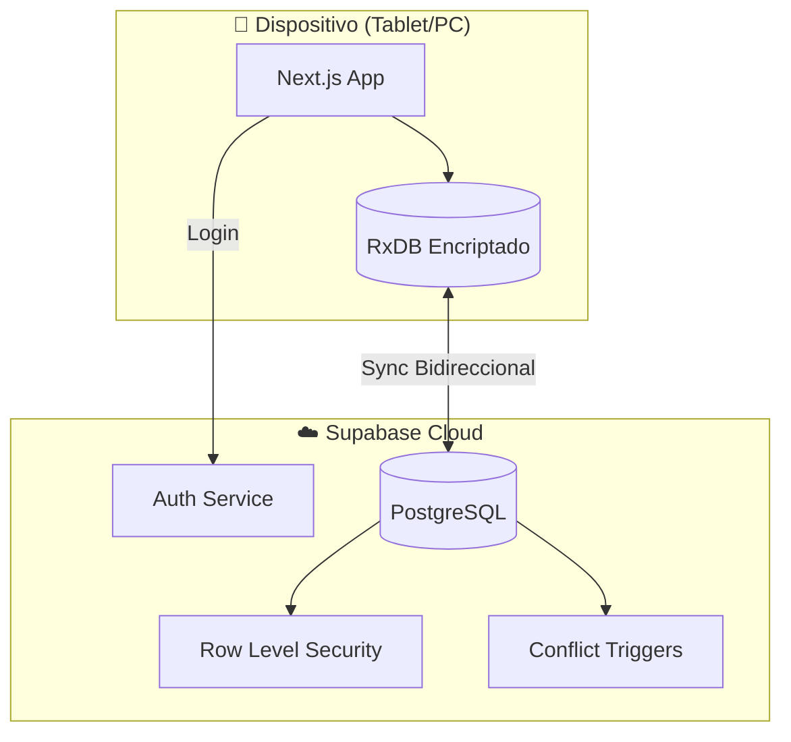
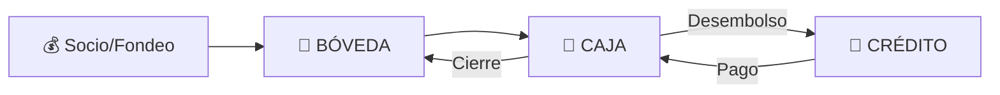
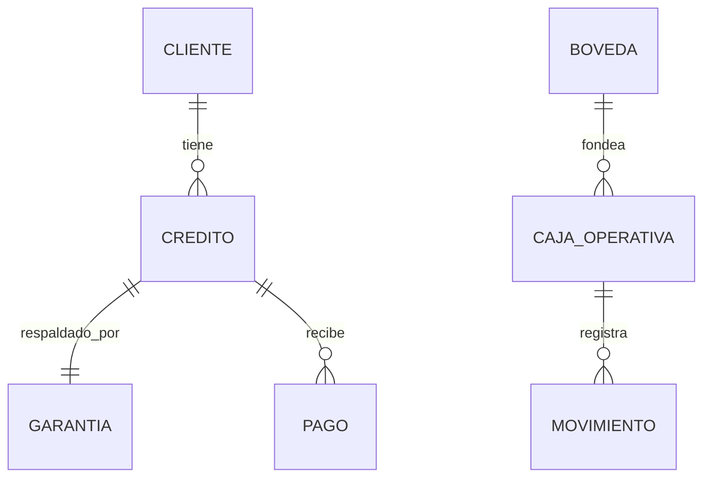

# 🏦 JUNTAY - BLUEPRINTS DEL SISTEMA

**Versión:** 4.5 | **Fecha:** 14 Diciembre 2025 | **Estado:** Producción (Enterprise Polish)

---

## 📋 Índice

1. [Visión General](#1-visión-general)
2. [Arquitectura](#2-arquitectura)
3. [Seguridad](#3-seguridad)
4. [Modelo de Datos](#4-modelo-de-datos)
5. [Módulos de Negocio](#5-módulos-de-negocio)
6. [Decisiones Técnicas (ADRs)](#6-decisiones-técnicas)
7. [Guía de Desarrollo](#7-guía-de-desarrollo)
8. [Roadmap](#8-roadmap)

---

## 1. Visión General

### ¿Qué es JUNTAY?

JUNTAY es un **sistema de gestión financiera de nivel bancario** diseñado para casas de empeño modernas. Opera bajo una arquitectura **Híbrida Inteligente** que combina lo mejor de Offline-First con capacidades Realtime:

- ✅ **Operación sin internet** - Las tablets siguen funcionando si cae la conexión
- ✅ **Sincronización Auditora** - Réplica exacta de campos de auditoría (`ip`, `user_agent`)
- ✅ **Integridad financiera** - Ledger inmutable (append-only)
- ✅ **Seguridad bancaria** - Datos encriptados localmente
- ✅ **Precisión decimal** - Cero errores de redondeo
- ✅ **UX Premium** - Diseño "Google Antigravity" con Glassmorphism

### Problemas que Resuelve

| Problema | Solución JUNTAY |
|----------|-----------------|
| Excel + WhatsApp manual | Sistema centralizado automatizado |
| Pérdidas por errores de cálculo | Ledger inmutable + Decimal.js |
| Robo de datos en dispositivos | Encriptación local AES-256 |
| Conflictos multi-dispositivo | Estados terminales + PostgreSQL triggers |
| Tasaciones inconsistentes | Matriz LTV estandarizada (30%-85%) |
| Errores de sincronización | Esquemas estrictos con migración automática |

### Stack Tecnológico

```yaml
Frontend:  Next.js 15 + React 19 + TypeScript
Estilos:   Tailwind CSS v4 + Google Antigravity (Glassmorphism)
DB Local:  RxDB + Dexie.js (IndexedDB encriptado)
DB Cloud:  Supabase (PostgreSQL 15)
Auth:      Supabase Auth + RLS
Sync:      RxDB Replication Plugin (v2 con Audit Fields)
Finanzas:  Decimal.js (precisión arbitraria)
```

---

## 2. Arquitectura

### Diagrama de Alto Nivel



### Arquitectura Offline-First

El sistema usa **RxDB** para almacenar datos localmente y sincronizarlos con Supabase:

1. **Escritura local primero** - Datos se guardan en IndexedDB inmediatamente
2. **Sincronización automática** - Cuando hay conexión, RxDB replica a Supabase
3. **Resolución de conflictos** - PostgreSQL triggers protegen estados terminales
4. **Encriptación** - Datos locales cifrados con clave derivada del usuario

### Flujo de Datos Financieros



---

## 3. Seguridad

### Encriptación Local (Opción 1A)

Los datos en IndexedDB están encriptados usando AES-256:

```typescript
// Clave derivada del usuario autenticado
password = session.user.id + APP_ENCRYPTION_SALT
```

**Resultado:** Si roban la tablet, los datos son ilegibles sin la sesión activa.

### Resolución de Conflictos (Opción 2C)

PostgreSQL triggers protegen contra sincronización conflictiva:

| Estado Terminal | Protección |
|-----------------|------------|
| `anulado` | Máxima prioridad, siempre gana |
| `vendido` | No puede revertirse |
| `remate` | No puede revertirse |
| `cancelado` | No puede revertirse |
| `pagado` | No puede modificar montos |

### Precisión Financiera (Opción 3B)

Todos los montos se almacenan como **strings** y se calculan con **Decimal.js**:

```typescript
import { dinero, sumar, formatearSoles } from '@/lib/utils/decimal'

const total = sumar("1500.00", "300.50")
console.log(formatearSoles(total)) // "S/ 1,800.50"
```

### Matriz de Roles

| Rol | Bóveda | Cajas | Créditos | Configuración |
|-----|--------|-------|----------|---------------|
| **Admin** | ✅ Total | ✅ Total | ✅ Total | ✅ Total |
| **Gerente** | 👁️ Ver | ✅ Abrir/Cerrar | ✅ Ver | ❌ |
| **Cajero** | ❌ | ✅ Solo su caja | ✅ Operar | ❌ |

---

## 4. Modelo de Datos

### Entidades Principales



### Tablas Core

| Tabla | Propósito | Tipo |
|-------|-----------|------|
| `boveda_central` | Capital total de la empresa | Singleton |
| `cajas_operativas` | Sesión de trabajo del cajero | Temporal |
| `movimientos_caja_operativa` | **LEDGER INMUTABLE** | Append-only |
| `creditos` | Contratos de préstamo | Negocio |
| `garantias` | Bienes en custodia | Negocio |
| `pagos` | Registro de cobros | Financiero |
| `clientes` | Información KYC | CRM |
| `system_settings` | Configuración dinámica | Singleton |

### Campos de Sincronización RxDB

Todas las tablas sincronizadas tienen:

```sql
_modified TIMESTAMPTZ DEFAULT NOW()  -- Timestamp de última modificación
_deleted BOOLEAN DEFAULT FALSE       -- Soft delete para RxDB
_audit_fields JSONB                  -- (Implícito) created_by, updated_by, ip_log, user_agent, etc.
```

---

## 5. Módulos de Negocio

### 📊 Tesorería (Bóveda)

- Inyección de capital de socios
- Asignación de fondos a cajeros
- Auditoría de movimientos de alto nivel

### 💼 Caja Operativa

- **Apertura:** Gerente asigna monto inicial
- **Operación:** Préstamos (salida) y Pagos (entrada)
- **Cierre ciego:** Cajero cuenta físico, sistema compara con lógico

### 📝 Créditos y Tasaciones

- **Tasación inteligente:** Matriz LTV por condición del bien
- **Originación:** Cálculo de interés en tiempo real
- **Validación:** Monto ≤ LTV × Valor tasación

### 🔄 Renovaciones

1. Cliente paga solo el interés acumulado
2. Se extiende fecha de vencimiento
3. Capital original permanece igual

### ⚖️ Remates

1. Crédito vence > X días
2. Garantía pasa a estado `en_remate`
3. Admin registra venta
4. Ingreso a caja como `venta_remate`

---

## 6. Decisiones Técnicas

### ADR-001: Arquitectura Local-First

**Contexto:** El negocio opera en zonas con internet inestable.

**Decisión:** Usar RxDB para almacenamiento local con sincronización a Supabase.

**Archivo:** [`docs/adr/001-local-first-architecture.md`](docs/adr/001-local-first-architecture.md)

### ADR-004: RxDB Offline-First

**Contexto:** Necesitamos operación sin internet y sincronización automática.

**Decisión:** Implementar RxDB con encriptación y conflict handlers.

**Archivo:** [`docs/adr/004-rxdb-offline-first.md`](docs/adr/004-rxdb-offline-first.md)

---

## 7. Guía de Desarrollo

### Prerrequisitos

- WSL 2 (Ubuntu 24.04)
- Docker Desktop con integración WSL
- Node.js LTS (vía nvm)
- Supabase CLI

### Setup Inicial

```bash
# 1. Clonar repositorio
git clone https://github.com/Mikisbell/juntay_api.git
cd juntay_api

# 2. Instalar dependencias
npm install

# 3. Copiar variables de entorno
cp .env.example .env.local

# 4. Levantar Supabase local
npx supabase start

# 5. Aplicar migraciones
npx supabase migration up

# 6. Iniciar desarrollo
npm run dev
```

### Variables de Entorno

```env
NEXT_PUBLIC_SUPABASE_URL=http://127.0.0.1:54321
NEXT_PUBLIC_SUPABASE_ANON_KEY=[de supabase status]
NEXT_PUBLIC_APP_SECRET_SALT=tu_salt_secreto
```

### Comandos Esenciales

```bash
npm run dev          # Desarrollo
npm run build        # Build producción
npm run lint         # Linter
npx supabase start   # DB local
npx supabase stop    # Detener DB
npx supabase db reset # Reset completo
```

### Estructura de Directorios

```text
src/
├── app/                  # App Router (páginas)
├── components/
│   ├── ui/               # shadcn/ui components
│   ├── pos/              # Componentes de punto de venta
│   ├── caja/             # Componentes de caja
│   └── providers/        # Contextos (RxDB, Auth)
├── lib/
│   ├── actions/          # Server Actions
│   ├── rxdb/             # Base de datos local
│   │   ├── database.ts   # Inicialización RxDB
│   │   ├── replication.ts # Sincronización
│   │   ├── schemas/      # Definiciones de colecciones
│   │   └── hooks/        # React hooks (useCreditos, etc.)
│   ├── utils/
│   │   └── decimal.ts    # Operaciones financieras precisas
│   └── supabase/         # Cliente Supabase
└── hooks/                # Hooks globales
```

---

## 8. Roadmap

### ✅ Fase 1: Infraestructura (Completado)

- [x] Schema PostgreSQL v3.0
- [x] RLS y triggers de seguridad
- [x] Arquitectura RxDB offline-first
- [x] Encriptación local
- [x] Decimal.js para finanzas

### ✅ Fase 2: Core Operativo (Completado)

- [x] Módulo de Caja
- [x] Módulo de Tesorería
- [x] Gestión de Créditos
- [x] Cotizador inteligente

### ✅ Fase 3: Ciclo de Vida Avanzado (Completado)

- [x] Proceso automático de estados (Vencido)
- [x] Integración impresoras térmicas (`TransactionSuccessView`)
- [ ] Notificaciones WhatsApp (WAHA)
- [ ] App móvil (React Native)

### 📋 Fase 4: Experiencia "Enterprise" (En Progreso)

- [x] UI System "Google Antigravity"
- [x] Gestión de Pagos Híbrida (Online/Offline)
- [x] Auditoría de Schema Drift
- [ ] Selector de Intención de Pago (Waterfall)
- [ ] Dashboard ejecutivo

- [ ] Dashboard ejecutivo
- [ ] Reportes exportables
- [ ] Predicción de morosidad
- [ ] KPIs en tiempo real

---

## 📚 Referencias

- [README.md](README.md) - Introducción al proyecto
- [README_DEV.md](README_DEV.md) - Guía detallada de desarrollo
- [docs/adr/](docs/adr/) - Decisiones arquitectónicas
- [docs/DEPLOYMENT_PRODUCTION.md](docs/DEPLOYMENT_PRODUCTION.md) - Guía de deployment

---

> **Este documento es la fuente única de verdad.** Cualquier documentación anterior que contradiga estos puntos está obsoleta.
