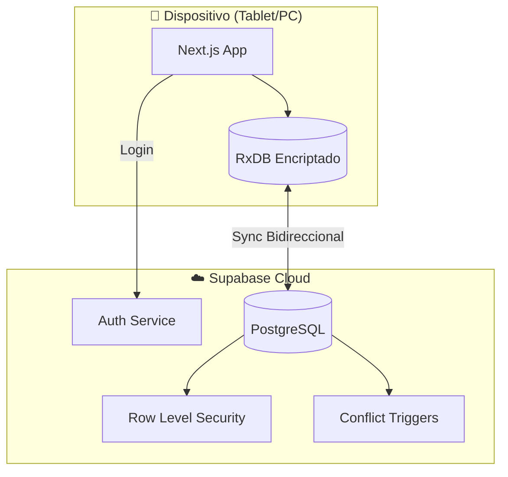
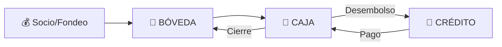
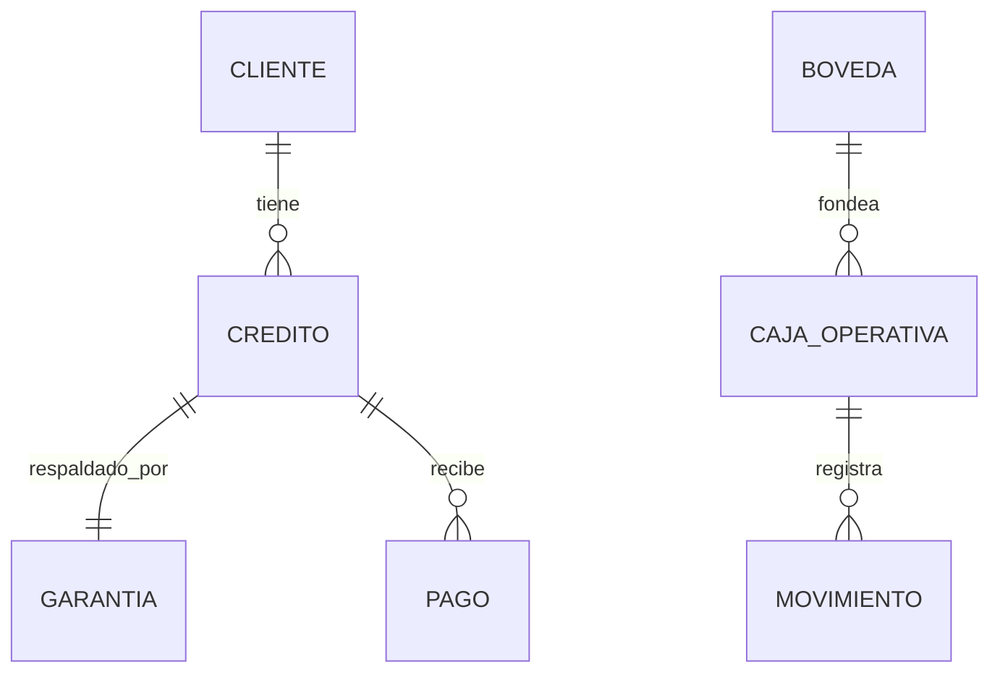

# 🏦 JUNTAY - BLUEPRINTS DEL SISTEMA

**Versión:** 4.6 | **Fecha:** 17 Diciembre 2025 | **Estado:** Producción + AI Features

---

## 📋 Índice

1. [Visión General](#1-visión-general)
2. [Arquitectura](#2-arquitectura)
3. [Seguridad](#3-seguridad)
4. [Modelo de Datos](#4-modelo-de-datos)
5. [Módulos de Negocio](#5-módulos-de-negocio)
6. [Decisiones Técnicas (ADRs)](#6-decisiones-técnicas)
7. [Guía de Desarrollo](#7-guía-de-desarrollo)
8. [Roadmap](#8-roadmap)

---

## 1. Visión General

### ¿Qué es JUNTAY?

JUNTAY es un **sistema de gestión financiera de nivel bancario** diseñado para casas de empeño modernas. Opera bajo una arquitectura **Híbrida Inteligente** que combina lo mejor de Offline-First con capacidades Realtime:

- ✅ **Operación sin internet** - Las tablets siguen funcionando si cae la conexión
- ✅ **Sincronización Auditora** - Réplica exacta de campos de auditoría (`ip`, `user_agent`)
- ✅ **Integridad financiera** - Ledger inmutable (append-only)
- ✅ **Seguridad bancaria** - Datos encriptados localmente
- ✅ **Precisión decimal** - Cero errores de redondeo
- ✅ **UX Premium** - Diseño "Google Antigravity" con Glassmorphism

### Problemas que Resuelve

| Problema | Solución JUNTAY |
|----------|-----------------|
| Excel + WhatsApp manual | Sistema centralizado automatizado |
| Pérdidas por errores de cálculo | Ledger inmutable + Decimal.js |
| Robo de datos en dispositivos | Encriptación local AES-256 |
| Conflictos multi-dispositivo | Estados terminales + PostgreSQL triggers |
| Tasaciones inconsistentes | Matriz LTV estandarizada (30%-85%) |
| Errores de sincronización | Esquemas estrictos con migración automática |

### Stack Tecnológico

```yaml
Frontend:  Next.js 15 + React 19 + TypeScript
Estilos:   Tailwind CSS v4 + Google Antigravity (Glassmorphism)
DB Local:  RxDB + Dexie.js (IndexedDB encriptado)
DB Cloud:  Supabase (PostgreSQL 15)
Auth:      Supabase Auth + RLS
Sync:      RxDB Replication Plugin (v2 con Audit Fields)
Finanzas:  Decimal.js (precisión arbitraria)
```

---

## 2. Arquitectura

### Diagrama de Alto Nivel



### Arquitectura Offline-First

El sistema usa **RxDB** para almacenar datos localmente y sincronizarlos con Supabase:

1. **Escritura local primero** - Datos se guardan en IndexedDB inmediatamente
2. **Sincronización automática** - Cuando hay conexión, RxDB replica a Supabase
3. **Resolución de conflictos** - PostgreSQL triggers protegen estados terminales
4. **Encriptación** - Datos locales cifrados con clave derivada del usuario

### Flujo de Datos Financieros



---

## 3. Seguridad

### Encriptación Local (Opción 1A)

Los datos en IndexedDB están encriptados usando AES-256:

```typescript
// Clave derivada del usuario autenticado
password = session.user.id + APP_ENCRYPTION_SALT
```

**Resultado:** Si roban la tablet, los datos son ilegibles sin la sesión activa.

### Resolución de Conflictos (Opción 2C)

PostgreSQL triggers protegen contra sincronización conflictiva:

| Estado Terminal | Protección |
|-----------------|------------|
| `anulado` | Máxima prioridad, siempre gana |
| `vendido` | No puede revertirse |
| `remate` | No puede revertirse |
| `cancelado` | No puede revertirse |
| `pagado` | No puede modificar montos |

### Protecciones de Base de Datos (Hardening)

| Amenaza | Protección Implementada |
|---------|-------------------------|
| **Quiebra Técnica** | `CHECK (saldo >= 0)` en Cuentas Financieras |
| **Fraude KYC** | Trigger impide créditos a clientes inactivos |
| **Doble Gasto** | Index Único en `numero_operacion` (Voucher Bancario) |
| **Manipulación Ledger** | `trg_ledger_smart_lock` impide UPDATE/DELETE en montos |
| **Auditoría Fantasma** | Server Actions fuerzan identidad `auth.uid()` (No confían en cliente) |

### Precisión Financiera (Opción 3B)

Todos los montos se almacenan como **strings** y se calculan con **Decimal.js**:

```typescript
import { dinero, sumar, formatearSoles } from '@/lib/utils/decimal'

const total = sumar("1500.00", "300.50")
console.log(formatearSoles(total)) // "S/ 1,800.50"
```

### Matriz de Roles

| Rol | Bóveda | Cajas | Créditos | Configuración |
|-----|--------|-------|----------|---------------|
| **Admin** | ✅ Total | ✅ Total | ✅ Total | ✅ Total |
| **Gerente** | 👁️ Ver | ✅ Abrir/Cerrar | ✅ Ver | ❌ |
| **Cajero** | ❌ | ✅ Solo su caja | ✅ Operar | ❌ |

---

## 4. Modelo de Datos

### Entidades Principales



### Tablas Core

### Tablas Core (Schema V2)

| Tabla | Propósito | Tipo |
|-------|-----------|------|
| `cuentas_financieras` | **[NUEVO]** Bóvedas Físicas y Cuentas Bancarias (BCP/Interbank) | Maestro |
| `inversionistas` | **[NUEVO]** Socios y Prestamistas que fondean la empresa | Maestro |
| `transacciones_capital` | **[NUEVO]** Ledger de tesorería (Aportes, Retiros, Fondeo) | Ledger |
| `cajas_operativas` | Sesión de trabajo del cajero | Temporal |
| `movimientos_caja_operativa` | **LEDGER INMUTABLE** | Append-only |
| `creditos` | Contratos de préstamo | Negocio |
| `garantias` | Bienes en custodia | Negocio |
| `pagos` | Registro de cobros | Financiero |
| `clientes` | Información KYC | CRM |

### B. Gestión de Capital (Arquitectura Virtual Vault)
El sistema ha eliminado la tabla física `boveda_central`. Ahora centraliza el dinero en `cuentas_financieras`.

1.  **Modelo de Datos**:
    *   **Bóveda Virtual:** Suma de `cuentas_financieras` donde `tipo = 'EFECTIVO'`.
    *   **Ledger Unificado:** `transacciones_capital` registra todo movimiento (Aportes, Traslados, Pagos).

2.  **Lógica "Blind Cashier" (Cajero Ciego)**:
    *   **Problema**: El cajero no debe decidir de qué bóveda sale el dinero por seguridad y simplicidad.
    *   **Solución Determinista**: Existe una única cuenta marcada como `es_principal = TRUE`.
    *   **Flujo Automático**: Al abrir caja, el sistema busca esta cuenta. Si tiene saldo, transfiere. Si no, bloquea la operación ("Fallo Seguro").
    *   **Auditabilidad**: Se registra como `APERTURA_CAJA` con metadata validada en servidor.

3.  **Integración Bancaria Perú**:
    *   Tipos explícitos: `YAPE`, `PLIN`, `CCI`, `CHEQUE`.
    *   Bancos normalizados: `BCP`, `BBVA`, `INTERBANK`.

4.  **Smart Locking (Inmutabilidad)**:
    *   **Trigger**: `trg_ledger_smart_lock`.
    *   **Regla**: `UPDATE/DELETE` prohibidos para campos financieros (`monto`, `cuentas`).
    *   **Excepción**: Se permite actualizar `descripcion` y `metadata` para correcciones operativas.
    *   **Impacto**: Garantía matemática de integridad histórica.

5.  **Auto-Liquidación (Cierre de Caja)**:
    *   **Trigger**: `trg_auto_liquidar_caja`.
    *   **Evento**: Al cambiar estado a `cerrada`.
    *   **Acción**: Transfiere `saldo_final` de Caja -> Bóveda Principal (`CIERRE_CAJA`).
    *   **Beneficio**: Previene "Dinero Atrapado" y asegura disponibilidad inmediata de fondos para el día siguiente.

### Campos de Sincronización RxDB

Todas las tablas sincronizadas tienen:

```sql
_modified TIMESTAMPTZ DEFAULT NOW()  -- Timestamp de última modificación
_deleted BOOLEAN DEFAULT FALSE       -- Soft delete para RxDB
_audit_fields JSONB                  -- (Implícito) created_by, updated_by, ip_log, user_agent, etc.
```

---

## 5. Módulos de Negocio

### 📊 JUNTAY-CAPITAL (Tesorería Avanzada)

- **Modelo Inversionista:** Gestión de Socios (Equity) y Prestamistas (Deuda).
- **Tesorería Multi-Cuenta:** Segregación estricta de cuentas Físicas (Bóveda) y Digitales (BCP, Interbank).
- **Integración Perú:** Soporte nativo para Yape, Plin y CCI con validación de unicidad de voucher.
- **Automatización:** Triggers contables mantienen los saldos en tiempo real sin intervención humana.

### 💼 Caja Operativa

- **Apertura:** Gerente asigna monto inicial
- **Operación:** Préstamos (salida) y Pagos (entrada)
- **Cierre ciego:** Cajero cuenta físico, sistema compara con lógico

### 📝 Créditos y Tasaciones

- **Tasación inteligente:** Matriz LTV por condición del bien
- **Originación:** Cálculo de interés en tiempo real
- **Validación:** Monto ≤ LTV × Valor tasación

#### 🚀 Tecnología de Reconocimiento 2026

**1. Fuzzy Search (Búsqueda Difusa)**
- **Herramienta:** Fuse.js (Client-side)
- **Catálogo:** `catalogo-bienes.ts` (+120 items indexados)
- **Feature:** Autocompletado tolerante a fallos ("celulr" -> "Celular")
- **Beneficio:** Normalización de datos sin fricción para el usuario.

**2. AI Vision (Visión Artificial Avanzada)**
- **Motor:** Google Gemini 1.5 Flash (Gratis) / OpenAI GPT-4o
- **Estrategia Multi-Shot:**
    - Análisis acumulativo: Múltiples fotos agregan información (Foto 1: Bien -> Foto 2: Defecto -> Foto 3: Accesorio).
    - Prompt Dinámico: Inyección de catálogo de subcategorías para normalización estricta.
- **Smart Factors (Factores de Tasación):**
    - UI interactiva para validación humana de sugerencias IA.
    - 🔴 **Defectos:** Detectados automáticamente (impacto negativo).
    - 🔵 **Accesorios:** Detectados automáticamente (impacto positivo).
- **Integración:** `QRPhotoBridge` activa análisis -> `vision-actions.ts` -> `SmartCreditForm` (Auto-fill).


### 🔄 Renovaciones

1. Cliente paga solo el interés acumulado
2. Se extiende fecha de vencimiento
3. Capital original permanece igual

### ⚖️ Remates

1. Crédito vence > X días
2. Garantía pasa a estado `en_remate`
3. Admin registra venta
4. Ingreso a caja como `venta_remate`

### 👷 Gestión de Empleados (KYE Lite)

Control de personal con enfoque en seguridad y contacto de emergencia:

**Tabla `empleados`:**
| Campo | Tipo | Propósito |
|-------|------|-----------|
| `estado` | ENUM | ACTIVO, LICENCIA, SUSPENDIDO, BAJA |
| `motivo_estado` | TEXT | Razón cuando estado ≠ ACTIVO |
| `nombre_contacto_emergencia` | VARCHAR | Nombre del contacto de emergencia |
| `parentesco_emergencia` | VARCHAR | Relación (Esposa, Padre, etc.) |
| `telefono_emergencia` | VARCHAR | Teléfono del contacto |

**Flujo de Invitación por Email:**
```
1. Admin registra empleado (sin user_id)
   ↓
2. Admin asigna email y clic "Enviar Invitación"
   ↓
3. Supabase Auth envía Magic Link al email
   ↓
4. Empleado hace clic → Se crea cuenta → Login automático
   ↓
5. empleados.user_id se vincula al auth.users.id
```

**Configuración Requerida:**
```env
NEXT_PUBLIC_SITE_URL=http://localhost:3000  # URL de redirección para magic links
```

**Desarrollo Local:** Los magic links se capturan en Inbucket (`http://localhost:54324`).

**Matriz de Estados:**
| Estado | Color | Puede operar | user_id activo |
|--------|-------|--------------|----------------|
| ACTIVO | 🟢 Verde | Sí | Sí |
| LICENCIA | 🟡 Ámbar | No | Sí (congelado) |
| SUSPENDIDO | 🔴 Rojo | No | No (deshabilitado) |
| BAJA | ⚫ Gris | No | Eliminado |

---

### 🔌 Server Actions (Backend)

Todos los server actions están en `src/lib/actions/`. Documentación completa:

#### Core Financiero
| Archivo | Funciones | Propósito |
|---------|-----------|-----------|
| `caja-actions.ts` | 5 | Apertura, cierre, movimientos de caja |
| `tesoreria-actions.ts` | 20 | Gestión multi-cuenta, capital, inversionistas |
| `financial-actions.ts` | 1 | Cálculos financieros generales |
| `intereses-actions.ts` | 5 | Cálculo y aplicación de intereses |
| `pagos-actions.ts` | 8 | Registro de cobros |
| `pagos-digitales-actions.ts` | 5 | Yape, Plin, transferencias |
| `pagos-rpc-actions.ts` | 1 | RPC de pagos |
| `monitor-cajas-actions.ts` | 2 | Monitoreo de cajas activas |

#### Créditos y Garantías
| Archivo | Funciones | Propósito |
|---------|-----------|-----------|
| `creditos-actions.ts` | 9 | CRUD de préstamos |
| `contratos-actions.ts` | 2 | Generación de contratos |
| `contratos-list-actions.ts` | 1 | Listado de contratos |
| `renovaciones-actions.ts` | 3 | Renovación de créditos |
| `garantias-mejoradas-actions.ts` | 9 | Gestión avanzada de garantías |
| `inventario-actions.ts` | 4 | Control de inventario |
| `remates-actions.ts` | 4 | Gestión de remates |
| `remates-module-actions.ts` | 5 | Módulo completo de remates |

#### Cobranza
| Archivo | Funciones | Propósito |
|---------|-----------|-----------|
| `vencimientos-actions.ts` | 5 | Detección de vencimientos |
| `alertas-cobranza-actions.ts` | 1 | Alertas de mora |
| `cobrador-movil-actions.ts` | 4 | App cobrador móvil |
| `kpis-cobranza-actions.ts` | 3 | KPIs de cobranza |
| `kpis-riesgo-actions.ts` | 2 | KPIs de riesgo |
| `ubicacion-actions.ts` | 4 | GPS de cobradores |

#### Integración Bancaria
| Archivo | Funciones | Propósito |
|---------|-----------|-----------|
| `integracion-bancaria-actions.ts` | 7 | Importar/exportar estados de cuenta |
| `conciliacion-actions.ts` | 5 | Conciliación automática |

#### Clientes y Scoring
| Archivo | Funciones | Propósito |
|---------|-----------|-----------|
| `clientes-actions.ts` | 11 | CRUD de clientes |
| `scoring-cliente-actions.ts` | 3 | Cálculo de TrustScore |

#### WhatsApp y Notificaciones
| Archivo | Funciones | Propósito |
|---------|-----------|-----------|
| `whatsapp-actions.ts` | 5 | Envío de mensajes |
| `waha-actions.ts` | 4 | Integración WAHA |
| `recibo-whatsapp-actions.ts` | 1 | Envío de recibos |
| `recibos-historial-actions.ts` | 3 | Historial de recibos |
| `recordatorios-config-actions.ts` | 4 | Configuración de recordatorios |

#### Dashboard y Reportes
| Archivo | Funciones | Propósito |
|---------|-----------|-----------|
| `dashboard-actions.ts` | 2 | Dashboard principal |
| `dashboard-gerencial-actions.ts` | 3 | Dashboard gerencial |
| `reportes-actions.ts` | 2 | Generación de reportes |
| `reportes-export-actions.ts` | 4 | Exportación PDF/Excel |
| `excel-export-actions.ts` | 1 | Exportación a Excel |

#### Multi-sucursal
| Archivo | Funciones | Propósito |
|---------|-----------|-----------|
| `sucursales-actions.ts` | 8 | CRUD de sucursales |
| `empleados-actions.ts` | 6 | Gestión de empleados |
| `auth-empleados-actions.ts` | 3 | Auth de empleados |

#### AI y Visión
| Archivo | Funciones | Propósito |
|---------|-----------|-----------|
| `vision-actions.ts` | 1 | Análisis de imágenes con AI |
| `categorias-sugeridas-actions.ts` | 3 | Sugerencias de categorías |
| `oro-actions.ts` | 2 | Cotización de oro |

#### Utilidades
| Archivo | Funciones | Propósito |
|---------|-----------|-----------|
| `eventos-actions.ts` | 6 | Sistema de eventos |
| `auditoria-actions.ts` | 2 | Logs de auditoría |
| `seed-actions.ts` | 1 | Datos de prueba |
| `render-status.ts` | 1 | Estado de Render.com |
| `pagos-wrapper.ts` | 0 | Re-export para uso en cliente (wrapper) |

---

## 6. Decisiones Técnicas

### ADR-001: Arquitectura Local-First

**Contexto:** El negocio opera en zonas con internet inestable.

**Decisión:** Usar RxDB para almacenamiento local con sincronización a Supabase.

**Archivo:** [`docs/adr/001-local-first-architecture.md`](docs/adr/001-local-first-architecture.md)

### ADR-004: RxDB Offline-First

**Contexto:** Necesitamos operación sin internet y sincronización automática.

**Decisión:** Implementar RxDB con encriptación y conflict handlers.

**Archivo:** [`docs/adr/004-rxdb-offline-first.md`](docs/adr/004-rxdb-offline-first.md)

### ADR-005: AI-Driven Input Normalization

**Contexto:** Los inputs de texto libre ("Otro") generan "basura" en la BD.
**Decisión:** 
1. **Fuzzy Search** en frontend para normalizar entrada sin restringir UX.
2. **AI Vision** para reducir carga cognitiva y error humano en catalogación.
**Stack:** Fuse.js (Local) + Google Gemini API (Cloud).

---

## 7. Guía de Desarrollo

### Prerrequisitos

- WSL 2 (Ubuntu 24.04)
- Docker Desktop con integración WSL
- Node.js LTS (vía nvm)
- Supabase CLI

### Setup Inicial

```bash
# 1. Clonar repositorio
git clone https://github.com/Mikisbell/juntay_api.git
cd juntay_api

# 2. Instalar dependencias
npm install

# 3. Copiar variables de entorno
cp .env.example .env.local

# 4. Levantar Supabase local
npx supabase start

# 5. Aplicar migraciones
npx supabase migration up

# 6. Iniciar desarrollo
npm run dev
```

### Variables de Entorno

```env
NEXT_PUBLIC_SUPABASE_URL=http://127.0.0.1:54321
NEXT_PUBLIC_SUPABASE_ANON_KEY=[de supabase status]
NEXT_PUBLIC_APP_SECRET_SALT=tu_salt_secreto
```

### Comandos Esenciales

```bash
npm run dev          # Desarrollo
npm run build        # Build producción
npm run lint         # Linter
npx supabase start   # DB local
npx supabase stop    # Detener DB
npx supabase db reset # Reset completo
```

### Estructura de Directorios

```text
src/
├── app/                  # App Router (páginas)
├── components/
│   ├── ui/               # shadcn/ui components
│   ├── pos/              # Componentes de punto de venta
│   ├── caja/             # Componentes de caja
│   └── providers/        # Contextos (RxDB, Auth)
├── lib/
│   ├── actions/          # Server Actions
│   ├── rxdb/             # Base de datos local
│   │   ├── database.ts   # Inicialización RxDB
│   │   ├── replication.ts # Sincronización
│   │   ├── schemas/      # Definiciones de colecciones
│   │   └── hooks/        # React hooks (useCreditos, etc.)
│   ├── utils/
│   │   └── decimal.ts    # Operaciones financieras precisas
│   └── supabase/         # Cliente Supabase
└── hooks/                # Hooks globales
```

---

## 8. Roadmap

### ✅ Fase 1: Infraestructura (Completado)

- [x] Schema PostgreSQL v3.0
- [x] RLS y triggers de seguridad
- [x] Arquitectura RxDB offline-first
- [x] Encriptación local
- [x] Decimal.js para finanzas

### ✅ Fase 2: Core Operativo (Completado)

- [x] Módulo de Caja
- [x] Tesorería Multi-Activo (Capital Module)
- [x] Integración Bancaria Perú (BCP/Yape)
- [x] Gestión de Créditos
- [x] Cotizador inteligente

- [x] Módulo de Caja
- [x] Módulo de Tesorería
- [x] Gestión de Créditos
- [x] Cotizador inteligente

### ✅ Fase 3: Ciclo de Vida Avanzado (Completado)

- [x] Proceso automático de estados (Vencido)
- [x] Integración impresoras térmicas (`TransactionSuccessView`)
- [ ] Notificaciones WhatsApp (WAHA)
- [ ] App móvil (React Native)

### 📋 Fase 4: Experiencia "Enterprise" (En Progreso)

- [x] UI System "Google Antigravity"
- [x] Gestión de Pagos Híbrida (Online/Offline)
- [x] Auditoría de Schema Drift
- [ ] Selector de Intención de Pago (Waterfall)
- [ ] Dashboard ejecutivo

- [ ] Dashboard ejecutivo
- [ ] Reportes exportables
- [ ] Predicción de morosidad
- [ ] KPIs en tiempo real

---

## 📚 Referencias

- [README.md](README.md) - Introducción al proyecto
- [README_DEV.md](README_DEV.md) - Guía detallada de desarrollo
- [docs/adr/](docs/adr/) - Decisiones arquitectónicas
- [docs/DEPLOYMENT_PRODUCTION.md](docs/DEPLOYMENT_PRODUCTION.md) - Guía de deployment

---

> **Este documento es la fuente única de verdad.** Cualquier documentación anterior que contradiga estos puntos está obsoleta.
