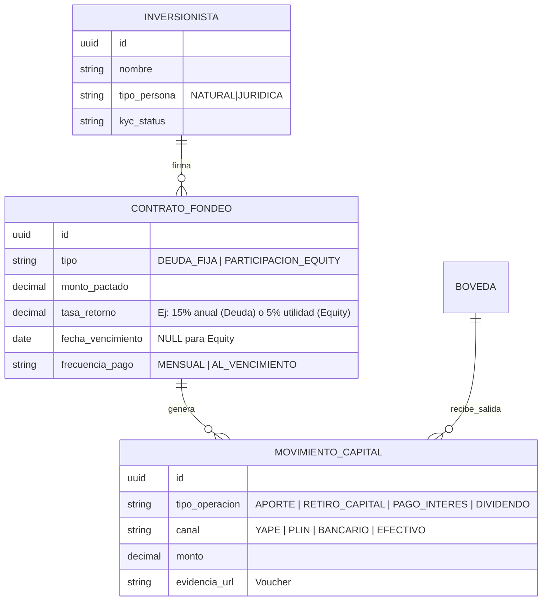

# Propuesta de Diseño: Módulo de Gestión de Inversiones y Fondeo (JUNTAY-CAPITAL)

## 1. El Desafío de la Flexibilidad
Tratar a un Socio (Equity) y a un Prestamista (Deuda) igual es un error contable grave.
- **Prestamista**: Es un costo operativo. Te cobra interés aunque pierdas dinero. Tiene prioridad de cobro.
- **Socio**: Es dueño del riesgo. Gana si hay utilidad neta. Es el último en cobrar.

## 2. Modelo de Datos Propuesto

Para soportar "ambos mundos" sin ensuciar el código, propongo separar **Quién** (Inversionista) de **Qué** (El Instrumento).

## 3. Flujo de Dinero (El Reto de Tesorería)

Cuando entra dinero de un socio por **Yape**, ocurren dos cosas simultáneas que el sistema debe garantizar (Doble Entrada):

1.  **Tesorería (Activo)**: Aumenta el saldo en Bóveda (o Caja Virtual).
2.  **Pasivo/Patrimonio (Obligación)**: Aumenta la deuda con el socio.

### Escenario A: Préstamo (Prestamista)
> "Te presto 10k al 5% mensual."
- **Mes 1**: El sistema genera una **Cuentra por Pagar (CxP)** de 500 soles.
- **Impacto**: Reduce tu utilidad operativa.

### Escenario B: Aporte de Capital (Socio)
> "Invierto 10k por el 10% de las acciones."
- **Mes 1**: No se genera cobro automático.
- **Cierre de Mes**: Si hubo 5000 de utilidad, el sistema calcula 500 para el socio (Dividendos).

## 4. Estrategia de Implementación
No toques `boveda_central` directamente. Crea un "buffer" de ingresos.

1.  Tabla `inversionistas` (Maestro).
2.  Tabla `contratos_inversion` (Reglas del juego).
3.  Tabla `transacciones_fondeo` (Log de Yape/Plin).
4.  **Trigger**: Al insertar en `transacciones_fondeo` -> Actualiza `boveda_central`.

## 5. Preguntas para el Arquitecto (Tú)
1.  **¿Retención de Impuestos?** ¿JUNTAY debe calcular el impuesto (IR) antes de pagar al socio?
2.  **¿Caja Virtual?** Si entra por Yape, ¿entra a la Bóveda Física o a una cuenta bancaria digital? (Actualmente Bóveda parece ser "dinero en mano").
